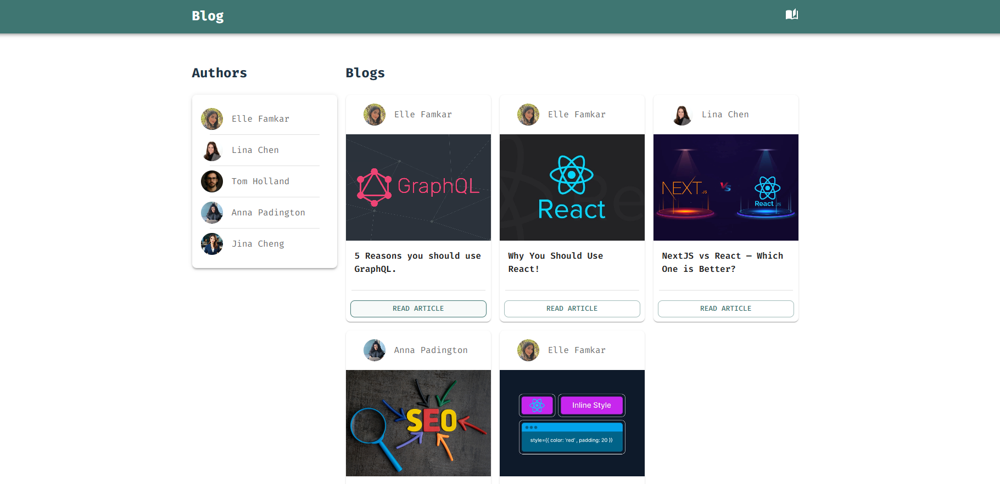
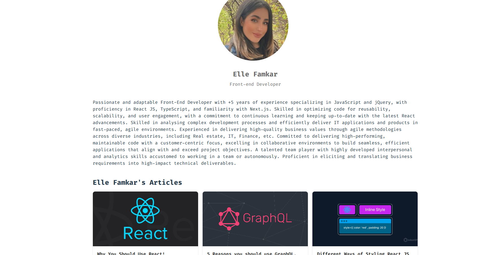
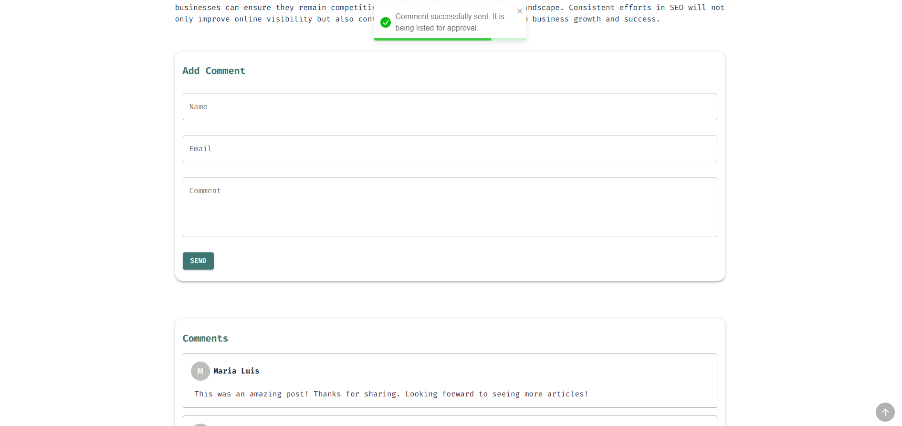
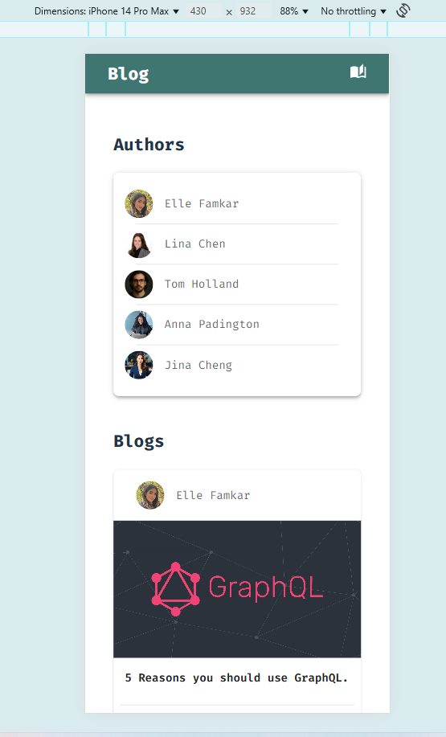
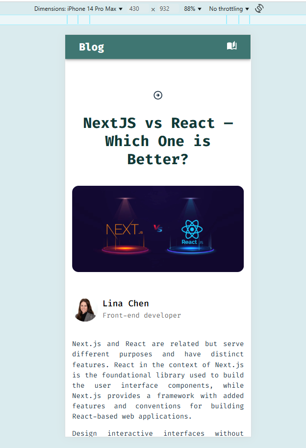

# Welcome to my Blog Application created with React using GraphQL 👋

## Available Scripts

In the project directory, you can run:
### `npm start`
### `npm run server`

## Table of contents

- [Overview](#overview)
  - [The challenge](#the-challenge)
  - [Screenshot](#screenshot)
  - [Links](#links)
- [My process](#my-process)
  - [Built with](#built-with)
  - [What I learned](#what-i-learned)
  - [Continued development](#continued-development)
  - [Useful resources](#useful-resources)
- [Author](#author)
- [Acknowledgments](#acknowledgments)

## Overview

Thanks for checking out my Sign Up form app project.
Remember that "Every day is a learning day" and try to learn from everyone! 

 ### Screenshot 







### Links

- Live Site URL: [Blog Application](https://sage-cactus-094ea3.netlify.app/)

## My process

### Where to find resources

The first think to do is to look for your perfect design! So let's checkout [dribble](https://dribbble.com/) for our favourite design to begin!

### Built with

- Reactjs
- GraphCMS (Hygraph)
- Apollo Client
- GraphQL
- Material-UI (MUI)
- React Router
- Mobile-first workflow
- DOMPurify
- React Toastify

You can use any tools you like to help you complete the project. So if you got something you'd like to practice, feel free to give it a try. However, i made it responsive for all the devices, since my users should be able to: View the optimal layout depending on their device's screen size

### What I learned

This projects helped me getting more deep on GraphQL and using queries and mutations while practicing more on MUI, use MUI components, handle form errors using toastify and  create a responsive project with small details on colors,sizes and so on.

To see parts of my codes and see how you can add code snippets, see below:

``` JSX

 const navigate = useNavigate();
  const { slug } = useParams();
  const { loading, data, error } = useQuery(GET_BLOG_INFO, {
    variables: {
      slug,
    },
  });

  return (
    <>
      {loading ? (
        <Loader />
      ) : error ? (
        <p>{error}</p>
      ) : (
        <Container maxWidth="lg">
          <Grid container spacing={2}>
            <Grid
              size={{ xs: 12 }}
              mt={9}
              display="flex"
              justifyContent="space-between"
              alignItems="center"
              sx={{
                flexDirection: { xs: "column-reverse", sm: "row" },
                textAlign: { xs: "center", sm: "left" },
              }}
            >
              <Typography
                component="h3"
                variant="h4"
                color="primary.dark"
                fontWeight={700}
                sx={{
                  mt: { xs: 4, sm: 0 },
                }}
              >
                {data.post.title}
              </Typography>
              <ArrowCircleRightOutlinedIcon
                sx={{ cursor: "pointer" }}
                onClick={() => navigate(-1)}
              />
            </Grid>
            <Grid size={{ xs: 12 }} mt={3}>
              
            </Grid>
            <Grid size={{ xs: 12 }} mt={4} display="flex" alignItems="center">
              <Link color="secondary" to={`/authors/${data.post.author.slug}`} style={{display: "flex", alignItems: "center", textDecoration: "none"}}>
                <Avatar
                  src={data.post.author.avatar.url}
                  sx={{ width: "60px", height: "60px", marginRight: "10px" }}
                />
                <Box component="div">
                  <Typography component="p" variant="h6">
                    {data.post.author.name}
                  </Typography>
                  <Typography component="p" variant="p" color="text.secondary">
                    {data.post.author.field}
                  </Typography>
                </Box>
              </Link>
            </Grid>
            <Grid size={{ xs: 12 }} mt={1}>
              <div
                className="blog-content"
                dangerouslySetInnerHTML={{
                  __html: DOMPurify.sanitize(data.post.content.html),
                }}
              ></div>
            </Grid>
            <Grid size={{ xs: 12 }}>
              <CommentForm slug={slug} />
            </Grid>
            <Grid size={{ xs: 12 }}>
              <Comments slug={slug} />
            </Grid>
          </Grid>
        </Container>
      )}
    </>
  );

```

### Useful resources

In order to do this project in a correct way you need to have a good knowledge of html and css, js and reactjs so let's master at them with these fruitful resources.

- [w3schools](https://www.w3schools.com/) - This helps you a lot with both your css and html which is easy to read and has numerous examples.
- [MDN](https://developer.mozilla.org/en-US/) - Remember that no matter how many tutorial videos you have watched, you always need to learn details and features from codes documentations
- [codeacademy](https://www.codecademy.com/)
- [udemy](https://www.udemy.com/) - Here you can find a number of tutorials in different languages
- [coursera](https://www.coursera.org/)

## Author

- Website - [Elle Famkar](https://ellefamkar.com/)
- Twitter - [@Ellefamkar](https://www.twitter.com/ellefamkar)

Feel free to ask any questions come to your mind  and send me message via my current temporary website in the link above!

## Acknowledgments

I am thankful to each and every person in this area who teaches me a single piece of code! I learn every single day from amazing people! so I need to thank you all ❤

**Have fun using this project!** 🚀
